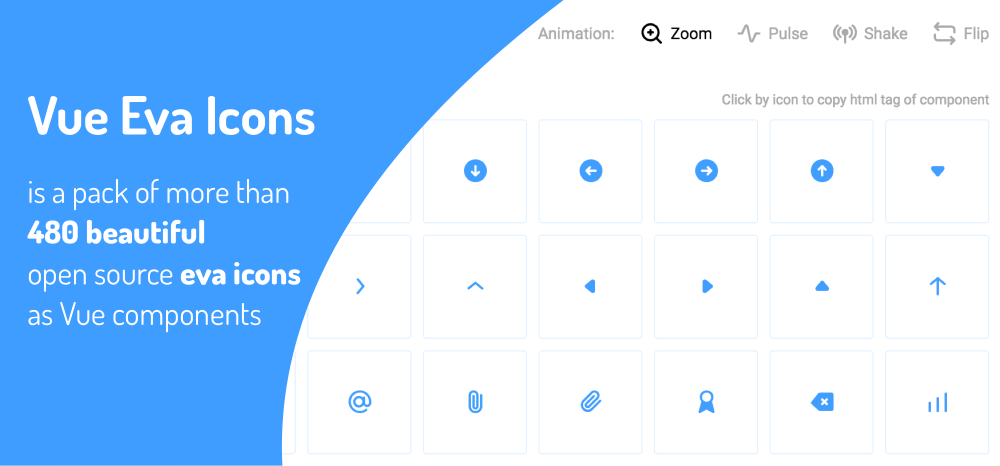

# Vue Eva Icons



Is a pack of more than 480 beautiful open source [eva icons](https://akveo.github.io/eva-icons) as Vue components

## Demo

[https://antonreshetov.github.io/vue-eva-icons](https://antonreshetov.github.io/vue-eva-icons/)

## Install

### NPM

Installing with npm is recommended and it works seamlessly with webpack.

```js
npm i vue-eva-icons
```

### Download

You can download latest version from the Github: [Download](https://github.com/antonreshetov/vue-eva-icons)

## Quick start

### Global

To use in your project, just import vue-eva-icons and install into Vue.

main.js

```js
import Vue from 'vue'
import App from './App.vue'
import EvaIcons from 'vue-eva-icons'

Vue.use(EvaIcons)

new Vue({
  render: h => h(App)
}).$mount('#app')
```

App.vue

```html
<template>
  <eva-icon name="github" animation="pulse" fill="limegreen"></eva-icon>
</template>
```

### On demand

```html
<template>
  <eva-icon name="github" animation="pulse" fill="limegreen"></eva-icon>
</template>

<script>
  import { EvaIcon } from 'vue-eva-icons'

  export default {
    components: {
      [EvaIcon.name]: EvaIcon
    }
  }
</script>
```

## Props

| Name        | Description        | Type     | Accepted values          |
| ----------- | ------------------ | -------- | ------------------------ |
| `name`      | Icon name          | `string` | -                        |
| `width`     | Width of icon      | `string` | -                        |
| `height`    | Height of icon     | `string` | -                        |
| `fill`      | Fill color of icon | `string` | HEX or color name        |
| `animation` | Type of animation  | `string` | zoom, pulse, shake, flip |

## Events

| Name    | Description                     | Payload |
| ------- | ------------------------------- | ------- |
| `click` | Triggered when icon was clicked | -       |
